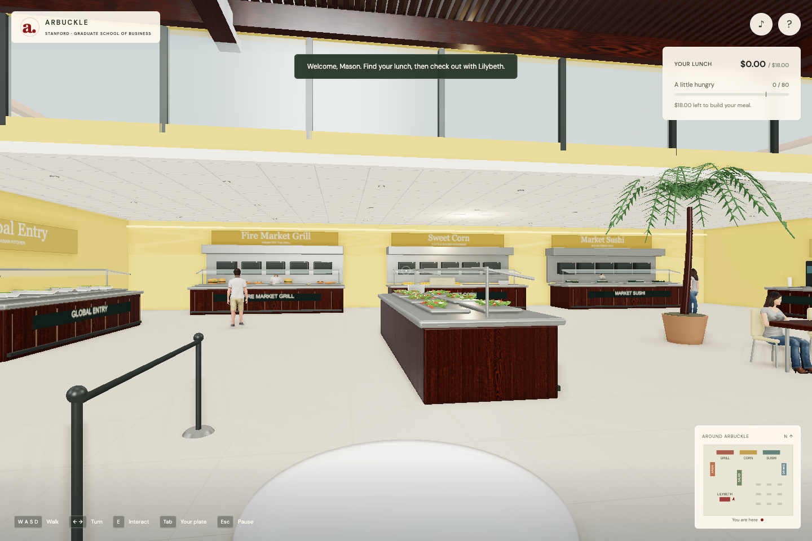

# A Little Lunch at Arbuckle

A first-person browser game inspired by Stanford GSB’s Arbuckle Dining Pavilion. Build a satisfying lunch within an $18 budget, scoop corn by hand, and check out with Lilybeth.



Read the [original prompt and design conversation](docs/design-conversation.md) for the initial request and the answers that shaped the game.

## Play in your browser

**[Play A Little Lunch at Arbuckle](https://gsbdarc.github.io/corn-scooping-game/)** — open the link in your desktop browser, wait for the characters to load, and start playing. No installation or GitHub account is needed.

The game is hosted on GitHub Pages and updates automatically when changes are pushed to `main`.

## Install and launch

You need a desktop or laptop, a keyboard, and a browser with WebGL 2 support. The game has been tested in Google Chrome on macOS. A mouse or trackpad provides manual scooping; keyboard alternatives are also available. Touchscreen-only play is not implemented.

Install [Node.js](https://nodejs.org/) version **22.12 or newer** (npm is included) and [Git](https://git-scm.com/downloads). Then open Terminal on macOS/Linux or PowerShell on Windows and run:

```sh
git clone https://github.com/gsbdarc/corn-scooping-game.git
cd corn-scooping-game
npm ci
npm run dev
```

Open **http://localhost:5173/**, wait for the character assets to load, and click the start button. If port 5173 is busy, open the local URL printed in the terminal instead. Keep that terminal running while you play; press **Ctrl+C** there to stop the server.

Prefer to skip Git? Choose **Code → Download ZIP** on this repository, extract it, open a terminal in the extracted folder, and run `npm ci` followed by `npm run dev`.

All character models, textures, and fonts are included. The game needs no API keys, accounts, Python installation, or asset downloads beyond installing the npm dependencies. Later visits only require `npm run dev` from the project folder.

## How to play

Build a meal with **80 satisfaction** while spending no more than **$18**. There is no time limit. Walk around, order dishes, scoop corn, and head to checkout when your meal is ready. Lilybeth serves the short queue, greets you with “Sir Mason, I saw Jeff earlier!”, and gives you a receipt and meal summary after payment. Prices and payments are fictional.

| Control                 | Action                                                                                     |
| ----------------------- | ------------------------------------------------------------------------------------------ |
| **W / A / S / D**       | Walk forward / left / backward / right                                                     |
| **Mouse or trackpad**   | Look around; control the scoop at the corn station                                         |
| **Left / right arrows** | Turn without a mouse while walking                                                         |
| **E**                   | Visit a nearby station, close its menu, or leave the corn counter                          |
| **Tab**                 | Inspect your plate, item prices, and satisfaction; return regular menu items before paying |
| **Esc**                 | Pause or close a menu                                                                      |
| **? button**            | Open controls, graphics settings, sensitivity, and movement-sway preferences               |
| **Music-note button**   | Toggle the quiet interaction sounds                                                        |

### Scoop corn by hand

1. Walk to **Sweet Corn** and press **E**.
2. Move the scoop over the corn tray and **hold the mouse button** to dip it into the corn.
3. **Release** the button to lift the filled scoop.
4. Move the scoop over your plate and **press again** to tip the kernels onto it.
5. Wait for the pour to finish, then scoop again or press **E** to leave.

Each scoop costs **$1.50**, including spilled kernels. Only corn that lands on the plate contributes to satisfaction. Kernels pile up, and an overfilled plate spills. Corn cannot be returned after scooping. For keyboard scooping, use the **arrow keys** to position the scoop and **Space** in place of the mouse button.

### Find your way around

You enter beside checkout. The salad island runs perpendicular to the back wall. Along the back wall, left to right, are the **grill**, **corn**, and **sushi** counters. **Asian food** is on the left wall and **drinks** are on the right. Students dine and walk around the room; the on-screen map shows the stations.

## Build and share

```sh
npm run build
npm run preview
```

Open the preview URL printed in the terminal, normally **http://localhost:4173/**. The generated **`dist/`** folder contains the complete website. To publish it, use a static host with `npm ci && npm run build` as the build command and `dist` as the publish directory, or upload the contents of an already-built `dist/` folder.

The default build serves from the root of a website. For the GitHub Pages repository path, use the dedicated commands:

```sh
npm run build:pages
npm run preview:pages
```

Open **http://localhost:4173/corn-scooping-game/**. This build sets the `/corn-scooping-game/` prefix for scripts, models, textures, fonts, and the credits page. If you rename the repository, update the Pages base path in `vite.config.js`.

### Publish with GitHub Pages

1. Ensure the repository's visibility and organization plan support GitHub Pages.
2. Open **Settings → Pages** in the repository and choose **GitHub Actions** as the publishing source.
3. Open **Actions → Deploy game to GitHub Pages → Run workflow** and select `main`.
4. After the workflow succeeds, open the deployment URL shown in the workflow or on the Pages settings page.

The [deployment workflow](.github/workflows/deploy-pages.yml) installs the locked dependencies, runs the game-state tests, builds the game, and publishes only `dist/`. Subsequent pushes to `main` automatically update the site. No deployment secrets are needed.

Use an HTTP(S) server. Double-clicking `index.html` as a `file://` URL will not load the 3D assets reliably. On the same Wi-Fi network, other computers can also use the network URL printed by `npm run dev` while that server is running; `localhost` works only on your own computer.

## Troubleshooting

- **`node` or `npm` is not recognized:** install Node.js, restart your terminal, and confirm `node --version` is at least 22.12.
- **Blank screen or graphics error:** use a browser with WebGL 2 enabled and turn on browser graphics/hardware acceleration. Load the terminal's HTTP URL rather than opening the HTML file directly.
- **Slow graphics:** open **?** or press **Esc** and select the lower graphics setting. You can also reduce movement sway in that panel.
- **Mouse look is inactive:** start or resume the game and click inside the 3D scene. Arrow keys also turn the player.
- **Corn will not dispense:** check your remaining budget, move the scoop over the tray, and hold the button until it fills. Finish the current pour before trying another scoop or leaving.
- **A hosted game cannot find its assets:** check that the complete `dist/assets/` folder was uploaded. Use `npm run build:pages` for the GitHub Pages project URL, or `npm run build` for a website hosted at its root URL.

## Validation

Run the six game-state tests with `npm test`. Run `npm run build` to check the production build.

For the three browser scenarios, install Google Chrome and start a server on exactly port 5173:

```sh
npm run dev -- --port 5173 --strictPort
```

Leave it running and, in a second terminal in the project folder, run:

```sh
npm run test:browser
```

The browser suite checks movement and counter collisions, all menus, budget limits, returning items, manually controlled corn scoops, spills and overflowing piles, the checkout queue, Lilybeth’s greeting, payment, and replay. Screenshots are written to the ignored `references/` directory.

After building, `node scripts/inspect-game.mjs --production` starts its own temporary preview server on port 4173 and checks asset loading, starting, walking, pausing, and resuming in Chrome. Leave port 4173 free when running that command.

For a Pages build, run `npm run build:pages` followed by `node scripts/inspect-game.mjs --production --pages`. To check the deployed site, run `node scripts/inspect-game.mjs --url=https://gsbdarc.github.io/corn-scooping-game/`. These checks also verify font loading and the credits link.

## Implementation and references

- Three.js, WebGL, Vite; no application framework or server required.
- Batched static geometry, physically based wood materials, sunlight, contact shadows, and ambient occlusion. Performance mode disables the more expensive lighting effects.
- Locally hosted, textured Microsoft Rocketbox characters; MIT license included with the assets.
- Wood Table 001 maps from Poly Haven (CC0), and DM Sans / Libre Caslon Display fonts (SIL Open Font License). Licenses and credits accompany the assets.
- Environment and food geometry, hand models, kernel trajectories, game logic, sound effects, and interface were created for this project.
- `src/layout.js` contains station coordinates. `src/game-state.js` contains prices, the budget, and satisfaction values.
- `scripts/fetch-assets.py` records the Rocketbox source download and texture conversion procedure. It is optional, requires Python and Pillow, and is not needed to install or play the game.

The environment is a modeled interpretation of the supplied walkthrough and public reference photos, with approximate dimensions, seating, and character likenesses. Lilybeth is an artistic representation based on the supplied description. Menu prices are game values. No real purchases occur.

Architectural references and full asset attribution are available in [the credits](public/credits.html) and through the game’s controls panel. Third-party asset licenses are included alongside the corresponding files.
